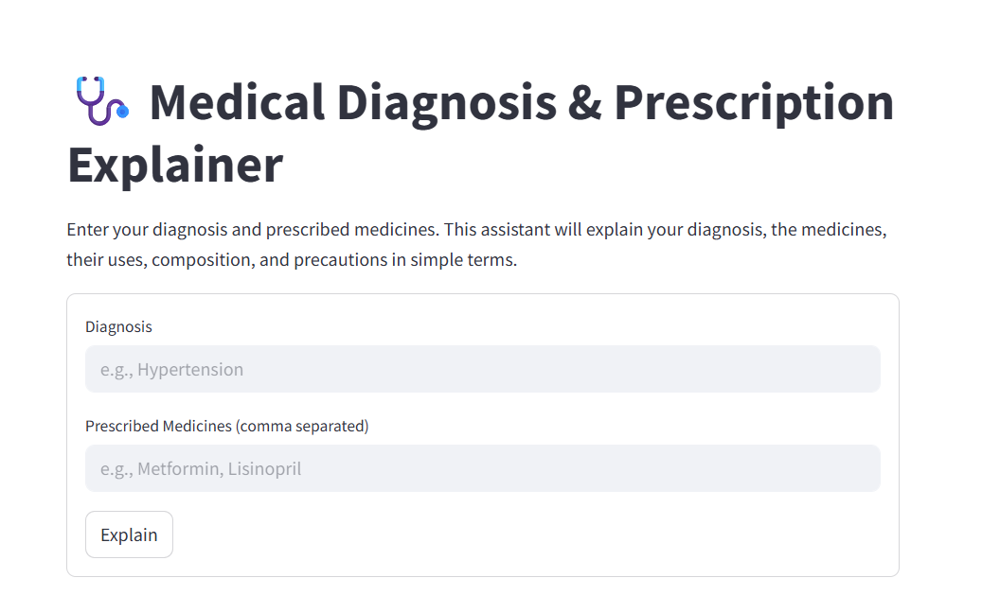

# Medical Diagnosis & Prescription Explainer



A Streamlit web app that helps patients understand their medical diagnosis and prescribed medicines in simple terms. Powered by OpenRouter's language model API, it explains diagnosis details, medicine uses, composition, precautions, and adds a light-hearted joke to cheer the patient.

---

## Features

- User inputs diagnosis and prescribed medicines (comma separated).
- Calls OpenRouter API to generate an easy-to-understand explanation.
- Displays the explanation with a friendly tone and a joke.
- Simple, clean, and responsive UI using Streamlit.

---

## Setup & Usage

1. **API Key Configuration**

   - Recommended: Store your OpenRouter API key in Streamlit secrets (`.streamlit/secrets.toml`):
     ```
     [openrouter]
     api_key = "YOUR_API_KEY"
     ```
   - Alternatively, use environment variables and uncomment the dotenv lines in the code.

2. **Install dependencies**

   ```
   pip install streamlit requests
   ```

3. **Run the app**

   ```
   streamlit run med-sum.py
   ```

4. **Enter your diagnosis and medicines, then click "Explain"**

---

## Code Highlights

- Uses `st.form` for structured user input.
- Constructs a prompt with diagnosis and medicines for the language model.
- Sends a POST request to OpenRouter API (`deepseek-r1:free` model).
- Displays the AI-generated explanation or error messages gracefully.

---

*Built using Streamlit and OpenRouter API*
```
